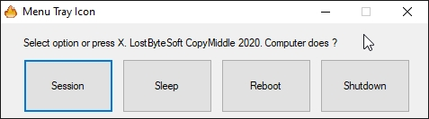

# ShutdownReboot

---------------------------------------------

A simple (exe) to reboot, shutdown, lock screen and sleep the computer.

Windows 64 bit required.

Compatibility: Win 7 , Win 8 , Win 8.1 , Win 10 , Win 11 ; 64 bit required

Put the exe where you want and make a shortcut to desktop.

The icons files must be in "%A_AppData%" .

A_AppData folder is normally c:\Users\YOUR NAME HERE\AppData\Roaming

You can write here without annoying popup !

For all programs ESCAPE key will abort.

I make this for esay way to reboot and shutdown Win 8, Win 10 & Win 11.

---------------------------------------------

Updated: 2021-06-20 to support win 11
Updated: 2022-01-20 with no reason provided.

---------------------------------------------

JUST DO WHAT YOU WANT WITH THE PUBLIC LICENSE

Version 3.1415926532 (January 2022)

TERMS AND CONDITIONS FOR COPYING, DISTRIBUTION AND MODIFICATION
   
Everyone is permitted to copy and distribute verbatim or modified copies of
this license document.

As is customary and in compliance with current global and interplanetary
regulations, the author of these pages disclaims all liability for the
consequences of the advice given here, in particular in the event of partial
or total destruction of the material, Loss of rights to the manufacturer
warranty, electrocution, drowning, divorce, civil war, the effects of radiation
due to atomic fission, unexpected tax recalls or encounters with
extraterrestrial beings elsewhere.

LostByteSoft no copyright or copyleft we are in the center.

--------------------------------------------------------------------
# --- End of file ---
